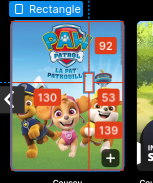

# Test technique TF1

## Questions

### Design

Scroll behaviour : One item at a time or by row ?
-> decided to do it by row, the Netflix way

Figma's design contains invisible frames, is it a mistake or something I don't understand ?

### Code

### API

Why put thumbnail inside program, program inside thumnail instead creating 'infinite depth' ?
-> maybe just put the ids ?

typo on thumnail (thumbnail)

program query is singular but returns multiple programs, it should be called programs in my opinion
